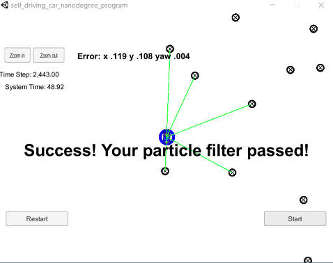

## Project Introduction
This project implemented a 2 dimensional particle filter for the vehicle localization in C++. 

The particle filter was given a map and some initial localization information (analogous to what a GPS would provide). At each time step the filter could also get observation and control data.

## Basic Build Instructions

1. mkdir build
2. cd build
3. cmake ..
4. make
5. ./particle_filter

## Result

The filter used 60 particles, and the localization error is [0.119, 0.108, 0.004] for x, y, and yaw respectively.

When using 10 particles, the filter also passed the simulator, but the localization error is larger, which is [0.166, 0.149, 0.004] for x, y, and yaw respectively.

Particles more than 60 didn't improve the localization accuracy much. This is the result with 100 particles.
